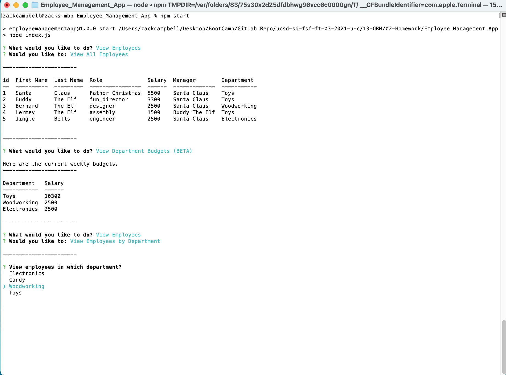

# Employee Management System
  -- Zack Campbell
  
  

  ## Description
  Using mySQL and Node/Inquirer, the app is intended to maintain relationships between employees, managers, salaries, roles, and departments. It allows users to create, read, update, and delete employees, roles, and departments via prompts in the command line. A video demo can be found [here.](https://youtu.be/JCbH6MRoyHY)
  
  ## Table of Contents 
  - [Installation](#installation)
  - [Usage](#usage)
  - [Credits](#credits)
  - [License](#license)
  - [Contributing](#contributing)
  - [Tests](#tests)

  
  
  ## Installation
  All required packages are required already, but you will need to set up the database and tables in mySQL (you can use db/schemas.sql) and then seed the database either by adding rows to the tables using the app itself, or use the provided seeds/seeds.sql file. Once all packets are installed (npm i from the command line), you will need to set up your .env file before you can run the app.
  ## Usage
  No rules or restrictions, go ahead and use all you want!!!!
  ## Credits
  none
  ## License
 The MIT License

  ---
  
  ## Contributing
  Feel free to contribute, all respong to any pull requests.
  ## Tests
  none